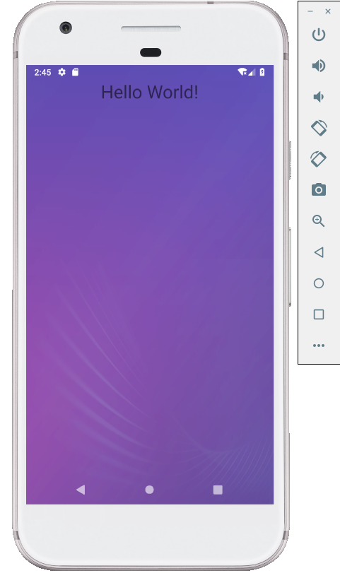
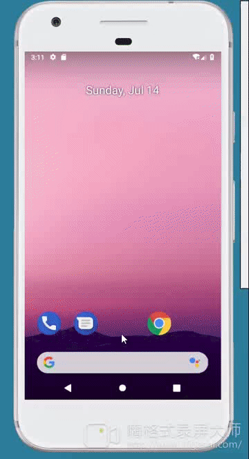
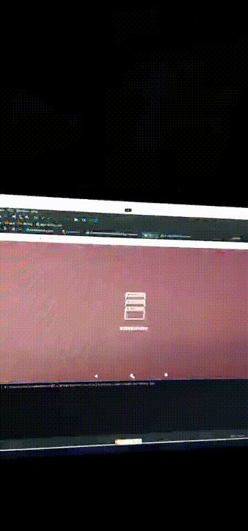
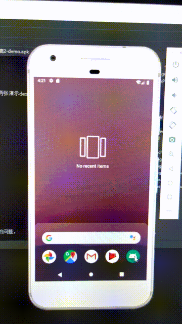

# CommonRemoveBlackPage
解决android冷启动黑画面的问题的一个综合解决方案，附带状态栏导航栏控制的demo工程。 同时实现了微信splash页面只启动一次的效果，splash页面还可以继续去做初始化框架和各种第三方库的操作。
有疑问可以qq联系我：1690829596（忘了我是谁）。

### 截图：
gif图展示了android冷启动的过程，没有任何黑画和白画效果，直接进入了程序。两张演示demo是沉浸式状态栏效果，你过你想不显示状态栏和导航栏只要在主题中设置下全屏即可.

#### 截图方案1：

#### 截图方案2 && 方案3错误写法演示 && 方案三正确写法演示：

#### 版本说明，分别展示每个方案的代码版本

##### 方案一代码,demo，gif的版本。

##### 方案二代码,demo，gif的版本。

##### 方案三代码,demo，gif的版本。

### 方案说明：
经过一天的整理和整车机多应用测试，整理出如下三种解决android首次启动黑画的问题，
下面每个方法都有自己的优点和缺点，根据自己的项目需求和使用场景选择即可，
另外可能还有更优的方案我没有发现也会后续会不断更新
    <!-- 主题基类 -->
    
    
    <!-- 方案一.去掉黑屏白屏展示的方案 开始-->
    <!--不预览法
        使用说明：直接设置为Application主题即可
        方案说明：设置windowDisablePreview为true,去掉预览功能，
        即页面没有加载完成时不展示画面，停留在点击画面。
        优点： 1.能够通过启动页展示的方式增加，过度掉黑白页，用户觉得自然，同时启动页可以做各种初始化操作，
                等进入主页已经完成了各种注册，释放逻辑页面的压力
               2.支持主题切换
        缺点：
              1. 引起卡顿，页面不加载完成不会进入app，如果特别卡需要优化应用的onResume之前的逻辑，
                尽量让页面展示出来以后再刷新UI等，不要阻碍UI展示
              2. 无法在启动页做各种初始化逻辑
    -->
    
    <!-- 方案一.去掉黑屏白屏展示的方案 结束-->
    
    
    
    <!-- 方案二.去掉黑屏白屏展示的方案 开始 -->
    <!--设置背景图片法
        使用说明：直接设置为Application主题即可
        方案说明：windowBackground设置一个固定图片.
        优点：1.比方案一更快进入app，有代入感
              2.适用于车机等多个App互相跳转的场景
              3.不影响android默认迁移的动画，因此不需要特殊处理动画迁移效果
              4.不引起卡顿
        缺点：1.无法像启动页那这样做预加载和初始化等逻辑，只是一个效果展示
              2.不支持切换主题，切换主题的各种方案都是通过积累注册方式，无支持style.xml中的图片替换
              3.如果设置透明点的图片会有黑色过度效果，比没优化效果还差
    -->
    
    <!-- 方案二.去掉黑屏白屏展示的方案 结束 -->
    
    
    
    
    <!-- 方案三.去掉android黑屏白屏展示的方案 开始 -->
    <!--启动页法
    使用说明：参照下面的方法区分启动页和其他页面分别设置不同主题
	方案说明：需要配合splash过度页去使用，splash可以不显示只是配合使用，
	    但是为了方式多应用互相调用引起异常，只有过渡页设置透明效果，其他页面不设置。
	优点： 1.能够通过启动页展示的方式增加，过度掉黑白页，用户觉得自然，同时启动页可以做各种初始化操作，
	        等进入主页已经完成了各种注册，释放逻辑页面的压力
	       2.支持主题切换
	缺点：
		  1. 因为透明效果就是指定window不显示，所以会卡顿在桌面一段时间。
		  2. 如果使用到车机多应用场景，因为windowIsTranslucent会影响正常的android时序，
		  用不好很可能会造成bug或者逻辑异常，需要做一些主题的特殊处理可以避免时序变化引起的风险
    -->
    <!-- Application通用 主题 -->
    
    
    <!-- 启动的MainActivity背景透明、显示状态栏和导航栏 主题 -->
    
    
    <!-- Splash活动或者广告页 主题 -->
    
    <!-- 方案三.去掉黑屏白屏展示的方案 结束 -->
    
    
    
    
 ### 参考及备注：
  有疑问可以qq联系我： 1690829596（忘了我是谁<FTD>）.
    
  另外，借鉴了如下两个文章关于解决黑画问题的思路，写的不错，也推荐下，我主要是理清了三种实现的步骤并且整理出一个demo去实践下，并且分析了单独应用场景和多应用车机场景的优劣区别，需要你根据自己的需求去选择使用。 没有最好的 方案，是有最适合你的方案，比如方案三其实是不错的方案，能够最大的优化启动时间并且能够自然过渡，只是规则复杂需要你懂得它对时序的破坏不要影响了逻辑造成bug即可，但是因为我们的车机需求是不能每个应用启动都带一个过渡动画，显得很繁琐，所以就使用了透明延迟一点的方案。
  https://www.jianshu.com/p/0026a01c6811
  https://juejin.im/post/5d1bb7c6f265da1ba84aab1c
 
  
  
